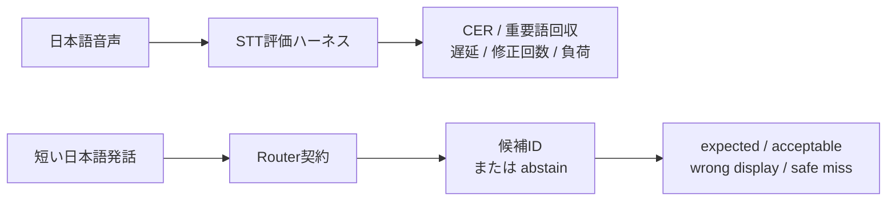

[English](README.md) | 日本語

# 日本語 STT と LLM Router の評価

Windows 上で、日本語音声認識（STT）と「短い発話 → 限定された候補IDのいずれか」への
ルーティングを、再現可能な条件で評価するための実験用リポジトリです。



2つの評価に共通する方針は、**失敗の種類を1つのaccuracyへ隠さず、別々に測ること**です。

## 評価するもの

### 音声認識

- CER（NFKC・casefold・空白と句読点の除去後の文字誤り率）
- keyword recovery（事前に固定した重要語の回収率。表記の別名は明示したものだけを認める）
- first-partial latency（最初の非 final が届くまで）と keyword-end latency（人が確認した語の言い終わりから最初の表示まで）
- end-to-end latency、partial の修正回数、final の安定時刻
- resource usage（ホスト／WSL worker／GPU 全体の CPU・RAM・VRAM、初期化時間、Windows のコミット余裕）
- 経路：WASAPI loopback（無音 render 維持の診断を含む）、直接マイク、会議アプリの相手側音声

### ルーティング

- expected hit / acceptable hit
- wrong display（主要指標。accuracy に混ぜない）
- correct abstain / missed but safe
- category breakdown（10カテゴリ、242問、16候補）
- latency / tokens / cost（hosted provider）

## 設計原則

- abstain（何も選ばない）は正式な結果として扱う
- 誤った選択は独立した指標として測る
- provider のスコアを校正済みの確率とはみなさない
- 評価用 fixture は provider 比較の前に封印する
- 欠測は件数として数え、0 に置き換えない。初回の試行で品質を、反復で安定性を測る
- fixture・ログ・リクエストに個人情報を入れない。fixture は架空で、音声と結果はローカルに留める

## リポジトリ構成

| パス | 内容 |
| --- | --- |
| `router_eval/` | router の契約、keyword baseline、評価専用の OpenAI router、封印済み dataset の loader、ランナー、送信前検査 |
| `stt_eval/` | 音声パイプライン、WASAPI 取得、エンジンアダプタ（WSL NeMo worker、hosted transcription、sherpa-onnx 候補）、比較ハーネス、指標、負荷サンプリング、localhost の録音・確認ページ |
| `fixtures/router-eval-v1/` | 封印済みのルーティング評価セット（架空） |
| `fixtures/test-plan.json`, `fixtures/natural-speech-prompts.json` | STT fixture 用の汎用例文と録音ガイド |
| `scripts/` | ランナー、fixture 準備、集計、環境構築、fixture 検証、privacy scan |
| `tests/` | ユニットテスト（プラットフォーム非依存。Windows 専用のケースは自動で skip） |
| `docs/` | 評価方法、STT の過去実測、Router 評価、環境 |

## クイックスタート

```
python -m pip install .
python -m unittest discover -s tests -t . -v
python scripts/validate_router_fixture.py
python scripts/run_router_eval.py --by-category --no-write
python scripts/run_router_eval.py --provider openai --dry-run
```

keyword baseline とテストには、音声デバイス・モデル・ネットワークのいずれも不要です。
STT ハーネスには [docs/environment.md](docs/environment.md) に記載した Windows と WSL の環境が必要です。
hosted エンジンには `OPENAI_API_KEY` の API キー、明示的な予算、明示的な `--confirm-send` が必要です。

## ドキュメント

- [docs/design-decisions.md](docs/design-decisions.md) — 評価設計の主要判断と公開根拠を後から整理した記録
- [docs/methodology.md](docs/methodology.md) — 指標の定義、公平性の規則、数値が意味するものと意味しないもの
- [docs/stt-evaluation.md](docs/stt-evaluation.md) — STT ハーネスの過去実測と、その条件
- [docs/router-evaluation.md](docs/router-evaluation.md) — ルーティング評価セット、ランナー、keyword baseline
- [docs/environment.md](docs/environment.md) — ハードウェア、ソフトウェアの版、セットアップ、依存とデータのライセンス
- [fixtures/router-eval-v1/README.md](fixtures/router-eval-v1/README.md) — 封印済みセットのラベル付け規則

## このリポジトリに含まれないもの

音声、音声 manifest、録音、認識全文、生ログ、モデルのチェックポイント、仮想環境、API キー、
provider ごとの実測結果。したがって `docs/` の過去の STT 数値はこのリポジトリだけでは再生成できず、
hosted router の結果もここには掲載していません。

## 状態

研究用の評価ハーネスです。本番用のアプリケーションではありません。

## ライセンス

MIT License。[LICENSE](LICENSE) を参照してください。
